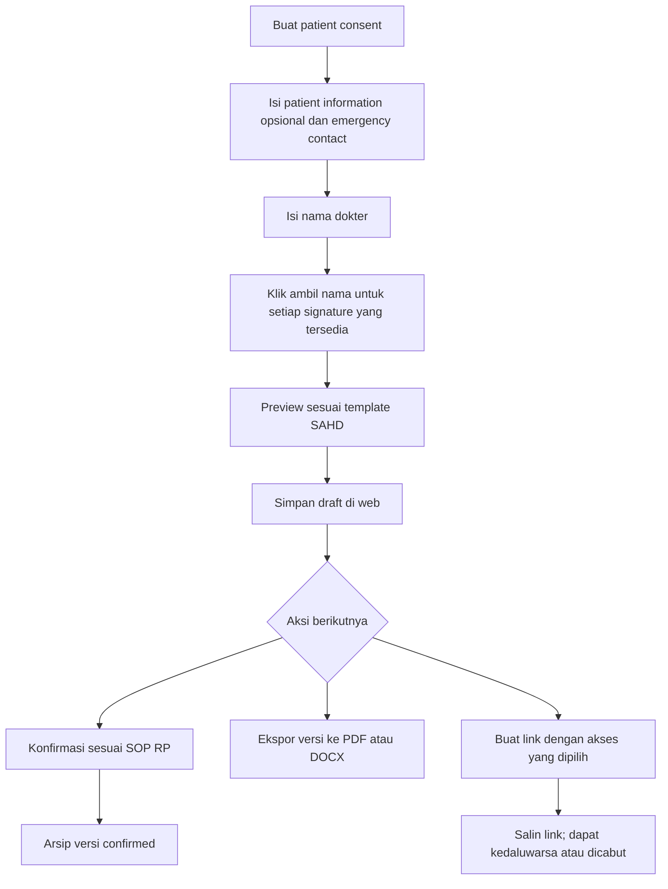

# Patient Consent — Spesifikasi format SAHD

> Aturan terbaru: SPRINT-4.md. Full name pasien, DOB, gender dan full name emergency contact sekarang wajib. Medic signature menyarankan nama user login dan mendukung input manual. Ketentuan lama yang bertentangan di bawah ini menjadi riwayat desain.
Status: format berdasarkan screenshot pengguna; 8 Oktober 2026.

## Format dokumen
Urutan dipertahankan: logo/letterhead Health Department — State of San Andreas; lokasi dan tanggal; Medical Consent Form dan nomor dokumen; tabel Patient Information; tabel Emergency Contact; Treatment and Services beserta lima paragraf persetujuan; tiga kolom Patient’s Signature, Medic’s Signature, Witness’s Signature.

Teks persetujuan ditranskripsikan apa adanya ke patient-consent-template.json. Nama, tanggal dan nomor dari screenshot merupakan contoh, bukan data default. Tanggal dokumen otomatis berdasarkan waktu pembuatan di WIB; nomor unik otomatis, format penomoran SAHD masih menunggu aturan. Contoh XII pada screenshot tidak diasumsikan sebagai bulan. Logo resmi membutuhkan aset terpisah; preview memakai identitas teks sementara.

## Field yang diisi user
| Bagian | Field | Aturan |
|---|---|---|
| Patient Information | Full name | Opsional; tidak wajib memilih record pasien |
| Patient Information | Date of birth | Opsional; simpan date ISO, tampil dd/mm/yyyy |
| Patient Information | Gender | Opsional; default kosong, bukan Man |
| Patient Information | Contact number | Opsional; string, menjaga nol awal |
| Emergency Contact | Full name | Sumber nama witness |
| Emergency Contact | Relationship to patient | Misalnya Friend; tidak diisi otomatis dari contoh |
| Emergency Contact | Contact number / contact person | Label dokumen mengikuti screenshot: Contact Number; string |
| Tanda tangan | Nama dokter yang menangani | Diisi user; boleh berbeda dari author yang menyimpan dokumen, keduanya dicatat terpisah |

Tidak meminta user mengisi ulang teks persetujuan, metadata nomor/tanggal atau menggambar tanda tangan. Emergency contact boleh kosong pada draft; kebijakan kelengkapan final dan kebutuhan witness mengikuti SOP yang belum ditetapkan. Opsionalnya informasi pasien tidak diubah menjadi validasi wajib terselubung.

## Tanda tangan
Semua pihak menggunakan satu font, ukuran, warna dan metode render. Patient memakai Full name dari Patient Information; Witness memakai Full name dari Emergency Contact; Medic memakai nama dokter yang diisi. Tombol masing-masing: Ambil nama pasien, Ambil nama emergency contact, Gunakan nama dokter.

- Tombol dinonaktifkan jika nama sumber kosong; dokumen tetap dapat disimpan dengan field kosong.
- Tanda tangan dibuat hanya ketika tombol diklik, bukan otomatis ketika nama diketik.
- Mengubah nama sumber menghapus tanda tangan sebelumnya dan meminta klik ulang.
- Simpan name_snapshot, source_field, applied_at, applied_by, signature_style_version. Applied berbeda dari confirmed_at; tindakan generate signature tidak otomatis menjadi konfirmasi persetujuan semua pihak.
- Status dokumen: draft, signature_prepared, confirmed dan void sebagai usulan. Konfirmasi mengikuti SOP RP; draft dapat diarsipkan dan diekspor dengan statusnya jelas. Belum menetapkan field opsional sebagai syarat final.
- Font yang sama harus tersedia pada browser, PDF dan DOCX. Produksi memakai font berlisensi dengan versi terkunci; DOCX menyertakan font bila lisensi mendukung atau memakai font yang didukung editor. Google Docs harus diverifikasi karena substitusi font dapat terjadi.

## Penyimpanan dan ekspor
Consent disimpan di database web dengan nomor, author employee, identitas opsional, emergency contact snapshot, tanda tangan, template/version, waktu dan status. Dapat dibuat mandiri tanpa encounter; bila terkait kunjungan, gunakan FK encounter opsional tanpa membuat pasien palsu. Versi final immutable; revisi menghasilkan versi baru.

| Output | Perilaku |
|---|---|
| Web | Daftar arsip, detail/preview, cari/filter, buka versi |
| PDF | A4, teks tetap + data + signature snapshot dari versi yang dipilih |
| DOCX | File Word kompatibel untuk dibuka/import ke Google Docs; tabel dan teks tetap editable |
| Google Docs native | Jalur tambahan jika yang dimaksud user adalah dokumen langsung di akun Google; memerlukan koneksi, mapping font dan verifikasi import |
| Link shareable | URL portal untuk versi tertentu, dapat disalin; tidak mengasumsikan semua dokumen publik |

Kata “docs” sementara mencakup DOCX yang kompatibel Google Docs; pembuatan Google Docs native belum diputuskan. Ekspor tidak mengubah consent atau status persetujuan. PDF dan DOCX mengacu snapshot yang sama. Layout dua halaman diperbolehkan saat nama/teks panjang; blok tanda tangan tidak terpotong, nama tidak dihilangkan agar muat.

## Link shareable
Default internal memerlukan login dan izin dokumen. Opsi link untuk penerima tanpa login dapat disediakan sebagai link akses khusus jika dipilih pembuat: token acak yang disimpan sebagai hash, izin view/download, expired_at opsional sesuai kebijakan, revoked_at, dan versi dokumen yang dipatok. Tidak menyertakan data pasien pada URL. Perubahan status void ditampilkan meskipun versi yang dibuka lama; download memeriksa link/izin kembali. Cegah indexing untuk link akses khusus; revoke segera menolak baca/download berikutnya.

Link tidak otomatis dibuat saat save dan tidak membuat file Google Docs menjadi publik. Tombol Buat link → pilihan akses → salin URL nyata setelah backend berhasil; jangan menampilkan placeholder sebagai link aktif.

## Penyesuaian database
| Tabel | Tambahan/perubahan |
|---|---|
| consents | encounter_id nullable, patient_id nullable, document_number unique, author_employee_id, document_date, status, current_version_id |
| consent_versions | patient_snapshot JSONB nullable fields, emergency_snapshot JSONB, doctor_name_snapshot, template_version_id, version, finalized_at |
| consent_parties | party_role patient/doctor/witness (witness menggantikan asumsi guardian); source_field, name_snapshot, applied_at, applied_by, signature_style_version, confirmed_at, confirmation_method |
| document_exports | format pdf/docx/google_doc, consent_version_id, private asset atau provider_file_id, export_status, checksum |
| consent_share_links | id, consent_version_id, created_by, token_hash unique, access_mode internal/link, expires_at, revoked_at, allow_download, created_at |

Snapshot kontak adalah milik consent; tidak otomatis mengubah profil pasien atau employee master. Jabatan dokter boleh diverifikasi melalui employee bila tersedia, tetapi nama yang user isi tetap sumber signature sesuai instruksi.

## Endpoint usulan
GET/POST /api/consents; GET /api/consents/:id; PATCH /api/consents/:id/draft; POST /api/consents/:id/signatures; POST /api/consents/:id/confirm; POST /api/consents/:id/exports dengan format; POST /api/consents/:id/share-links; DELETE /api/consents/:id/share-links/:linkId (revoke); GET /share/consent/:token.
Semua write memakai izin medis, validasi versi untuk konflik edit, dan audit. Ekspor asynchronous dapat memberi status queued/running/ready/failed. Author-only/global access ditentukan izin, bukan karena nama dokter sama.

## Activity diagram

## Kriteria penerimaan
1. Semua informasi pasien kosong tetap dapat menyimpan draft; tidak mewajibkan record pasien tersembunyi.
2. Klik patient/witness menghasilkan nama dari field tepat; kosong tidak menghasilkan signature palsu.
3. Ketiga signature memakai style identik; perubahan nama membatalkan signature lama.
4. Teks tetap dan struktur referensi tidak berubah; nomor/tanggal unik berasal dari metadata, bukan screenshot contoh.
5. Save-load mempertahankan data/version/signatures; author terpisah dari dokter yang menangani.
6. PDF/DOCX cocok dengan snapshot, termasuk karakter khusus/nama panjang/field kosong.
7. Link internal mengikuti permission; link khusus valid, kedaluwarsa, dicabut dan dokumen void memberi perilaku benar.
8. Ekspor/akses ditolak untuk divisi tanpa izin; file tidak disimpan sebagai URL publik otomatis.

## Status deliverable saat ini
patient-consent-preview.html: form, preview, klik signature, draft localStorage, dan print-to-PDF browser. Tidak ada backend database, DOCX export, Google Docs native, atau link publik aktif. Preview signature menggunakan font cursive lokal yang seragam per browser; produksi harus memakai aset font terkunci agar konsisten antareditor. Perubahan Figma masih tertunda karena kuota tool Starter.

## Referensi consent dan logo resmi — revisi terbaru
Format consent mengikuti screenshot yang diberikan ulang oleh pengguna. Logo resmi kini tersedia di assets/sahd-logo-warna.webp dan menggantikan placeholder logo pada preview consent serta branding preview Sprint 6. Logo berwarna yang diberikan menggantikan logo teal pada contoh kop; heading HEALTH DEPARTMENT / STATE OF SAN ANDREAS, tabel, isi lima klausul dan urutan signature dipertahankan. Gunakan rasio asli, object-fit contain, tanpa recolor/crop. Identitas/tanggal/nomor pada screenshot adalah contoh, bukan nilai default pasien baru. Ketiga signature tetap satu gaya sesuai Sprint 4 walaupun contoh screenshot memiliki gaya witness berbeda. Field wajib tetap Sprint 4. Preview lokal diperbarui; file Figma belum disinkronkan karena batas MCP yang telah dilaporkan.
