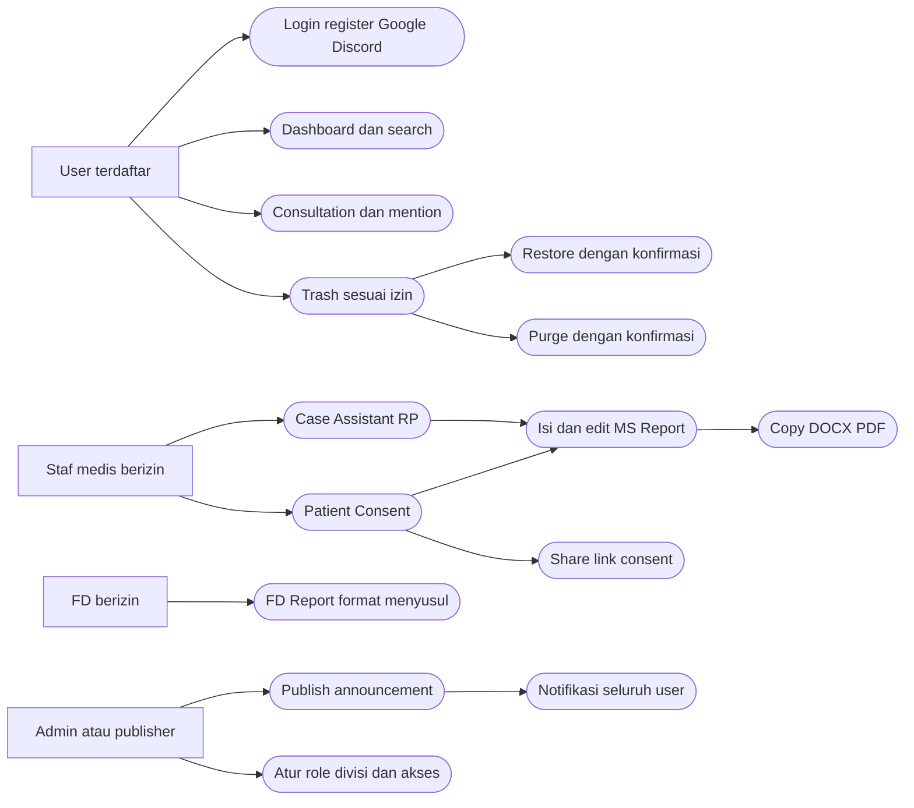
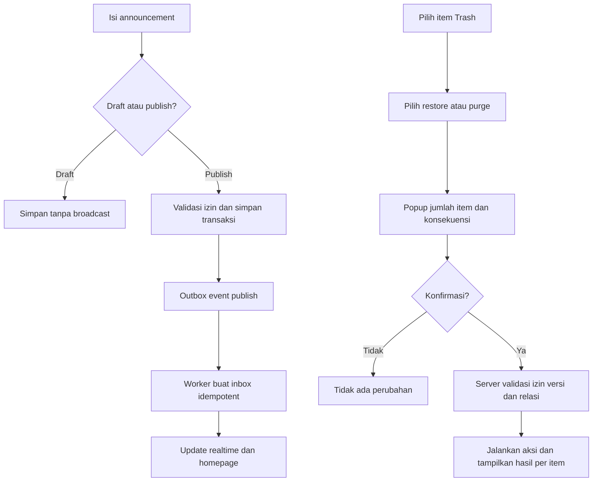

# Executive RP — Spesifikasi konsolidasi Sprint 1–6
Tanggal: 8 Oktober 2026. Dokumen ini adalah indeks otoritatif; rincian tiap sprint di tautan berikut. SPEC.md sebelumnya menjadi arsip/roadmap bila bertentangan.

## Scope dan stack
Portal internal GTA RP untuk Medical Service dan Fire Department. Next.js + TypeScript, shadcn/ui + Tailwind CSS, deployment Vercel, domain clarishna.my.id tetap digunakan. Hostname/subdomain final belum ditetapkan. Database persisten, object storage privat, auth engine dan transport realtime merupakan dependensi yang belum dipilih; bukan perubahan stack frontend.

| Sprint | Modul | Hasil |
|---|---|---|
| [1](SPRINT-1.md) | Auth, navbar, account, dashboard | Register/Google/Discord; General/Members; role/divisi view-only; surgery line chart enam filter; kartu minor/major; kasus consultation terbaru |
| [2](SPRINT-2.md) | MS Report | Case → form berbasis template → preview editable, copy, DOCX/PDF; pencitraan CT/MRI/X-Ray fiktif RP |
| [3](SPRINT-3.md) | Case Assistant | TTV before/after, anestesi, instrumen, follow-up/discharge, /me /do; prefill MS report dengan provenance |
| [4](SPRINT-4.md) | Patient Consent | Format supplied; form wajib terbaru; signature seragam dari nama; live preview, database, share link, DOCX/PDF |
| [5](SPRINT-5.md) | Consent list dan Consultation | Filter tanggal, create/edit/soft-delete consent; link ke MS report; consultation form dan mention jabatan/role/user |
| [6](SPRINT-6.md) | Announcement dan Trash | Tabel, filter, publish broadcast seluruh user; soft delete; row/bulk restore/purge dengan konfirmasi; retensi 30 hari |

Navbar: logo → search (⌘K / Ctrl+K) → notification → avatar/account. Sidebar: Dashboard, Report (Medical Service / Fire Department), Patient Consent, Case Assistant, Consultation, Announcement, Trash. Notification filter All / Mentioned / Janji Temu; klik ke objek asal. Announcement global masuk All. Duty realtime dan rekap Senin–Minggu tetap roadmap karena belum ditempatkan pada enam sprint revisi. Login tidak lagi mensyaratkan player online FiveM.

## Use case

## Activity: publish dan Trash

## Model database logis
Nama berikut adalah rancangan, bukan migration yang sudah diterapkan. Semua waktu disimpan UTC dan ditampilkan WIB.

| Tabel | Field penting / relasi |
|---|---|
| users | id PK, display_name, email nullable, password_hash nullable, avatar_url, status, notification_preferences, created_at |
| auth_accounts | id, user_id FK, provider, provider_subject; UNIQUE(provider, provider_subject); account linking perlu pembuktian akun |
| sessions | id, user_id FK, token_hash, expires_at; strategi aktual mengikuti auth engine |
| divisions / roles / user_assignments | Divisi MS/FD, jabatan dan functional role terpisah; admin assigned |
| encounters | id, patient identity snapshot, case_title, created_by, division_id |
| consultations | id, encounter_id nullable, template_version, form_data, appointment_at, created_by, created_at |
| mention_targets / mention_recipients | consultation_id, target_type, target_id; recipient user snapshot yang dideduplikasi |
| assistant_cases | id, encounter_id, input_case, suggested_data, provenance, sop_version |
| reports / report_versions | id, encounter_id, division, report_type, status, performed_at; version form_data, editable_content, template_version |
| consents / consent_versions | id, encounter_id, created_by; versi patient/emergency snapshots, signatures seragam, static_template_version |
| report_consent_links | report_id, consent_id, consent_version_id; finalized version pinned |
| consent_share_tokens | consent_version_id, token_hash, expires_at, revoked_at; akses scoped tanpa identitas internal |
| announcements | id, title, content, status, created_by, created_at, published_at |
| notification_events / outbox | id, event_type, resource_type/id, payload, status, retry_count; unique publication event |
| notifications | id, event_id FK, recipient_id FK, is_mentioned, read_at, created_at; UNIQUE(event_id, recipient_id) |
| deletion_batches | id, actor_id, action, created_at, per-item result; opsional untuk bulk audit |
| audit_logs | actor_id, resource_type/id, action, timestamp; tidak menyimpan password/token |

Soft-deletable resource memiliki deleted_at, deleted_by, purge_after, row_version. Trash adalah query terpadu resource ini, bukan duplikasi seluruh isi ke tabel lain. Index tanggal, FK, status serta deleted_at sesuai query; transaksi menjaga publikasi/outbox dan link report/consent konsisten. Ekspor dan share selalu memeriksa izin/status server.

## Dependensi dan hal yang menunggu
- Format operasi MS sudah diberikan: [MEDICAL-REPORT.md](MEDICAL-REPORT.md). Format consultation tersedia pada [CONSULTATION.md](CONSULTATION.md). Format psychiatry dan FD masih menyusul.
- Case Assistant hanya untuk skenario RP/SOP server; rekomendasi tidak dipresentasikan sebagai pemeriksaan pasien nyata. Pencitraan adalah ilustrasi fiktif.
- Endpoint callback, provider auth, database, storage, transport realtime dan hostname diputuskan saat implementasi; rencana deployment ada pada [DEPLOYMENT-AUTH.md](DEPLOYMENT-AUTH.md).
- [FIGMA.md](FIGMA.md) mencatat file personal dan gap aktual. Preview Sprint 6: [sprint-6-preview.html](sprint-6-preview.html).
- Template operasi sumber: [medical-report-template.txt](medical-report-template.txt), field model: [medical-report-schema.json](medical-report-schema.json).
- Ini spesifikasi dan prototype; auth/backend/ekspor produksi belum diimplementasikan atau diuji deployment.

## Template Announcement terbaru
[ANNOUNCEMENT.md](ANNOUNCEMENT.md) dan [announcement-schema.json](announcement-schema.json): title wajib, subtitle opsional, rich text dengan custom font dan Insert table; susunan teks → tabel → footer didukung dalam body editor. Preview Sprint 6 lama masih form sederhana, bukan contoh rich editor terbaru.
