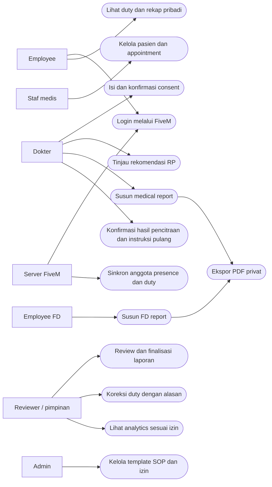
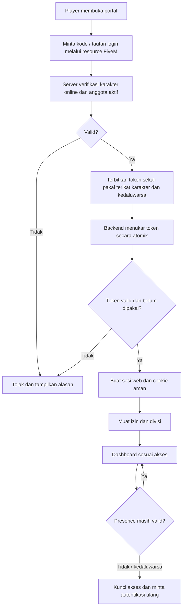
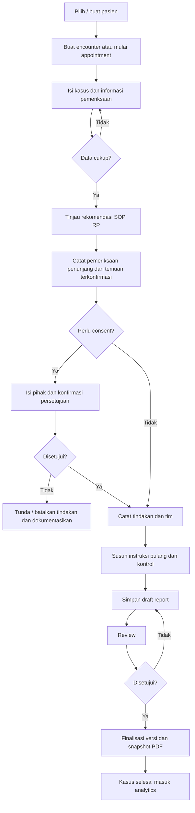
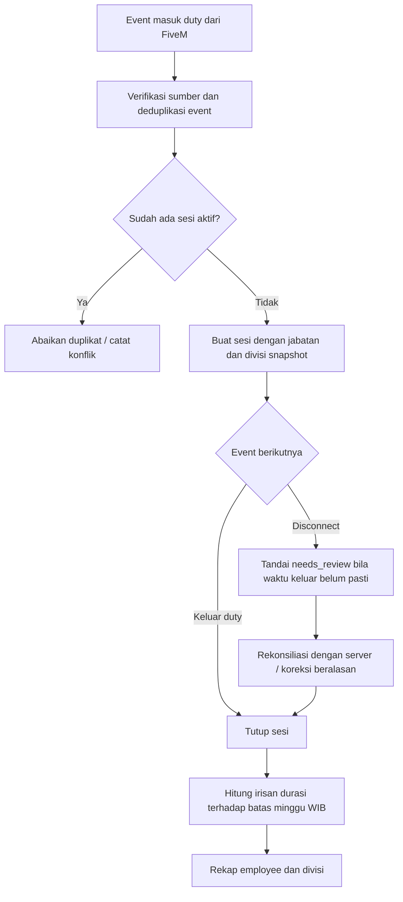
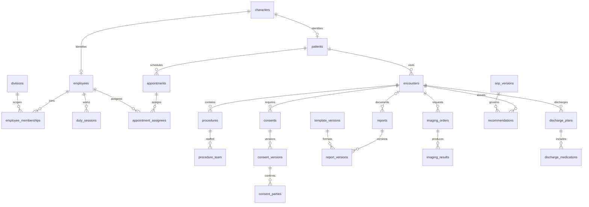
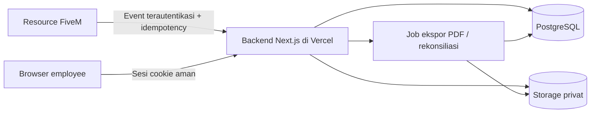

> **Revisi terbaru:** [SPEC-LATEST.md](SPEC-LATEST.md) mengonsolidasikan Sprint 1–6 dan menggantikan bagian lama yang bertentangan.

# Executive RP — Spesifikasi Portal Operasional v1

> Scope Sprint 1 terbaru: lihat SPRINT-1.md. Revisi tersebut menggantikan login FiveM, susunan homepage/menu dan account settings lama yang bertentangan; bagian lama dipertahankan sebagai roadmap.
Tanggal: 8 Oktober 2026 • Status: draft untuk review • Bahasa: Indonesia

## 1. Tujuan dan batas lingkup
Portal internal medis dan FD untuk duty, janji temu, consent, laporan, analytics, dan bantuan skenario GTA RP. Konten klinis termasuk obat/dosis adalah konten fiktif yang disetujui pengelola server, bukan panduan medis dunia nyata. Rekomendasi harus ditinjau dokter; hasil pencitraan tidak otomatis dianggap temuan nyata.

Keputusan disepakati: Next.js, TypeScript, shadcn/ui, Tailwind CSS, Vercel; domain dapat memakai subdomain clarishna.my.id. Usulan: PostgreSQL, penyimpanan objek privat, WIB, login dengan token sekali pakai dari server, review laporan, PDF, dan audit. Penyedia serta aturan final belum diputuskan.

## 2. Aktor dan matriks akses
| Aktor | Lingkup | Kewenangan awal (usulan) |
|---|---|---|
| Employee | Divisi sendiri | Profil, duty sendiri, laporan sesuai izin |
| Staf medis | Medis | Pasien, appointment, draft sesuai jabatan |
| Dokter | Medis | Consent, tindakan, hasil pemeriksaan, rekomendasi, laporan |
| Reviewer/pimpinan | Divisi yang ditugaskan | Review/finalisasi, rekap duty, koreksi dengan alasan |
| Employee FD | FD | Laporan FD, duty sendiri |
| Admin | Administrasi | Employee, izin, template; akses klinis tetap izin terpisah |
| Server FiveM | Integrasi | Identitas, keanggotaan, presence dan event duty |

Semua izin diperiksa di server pada baca/tulis/ekspor, bukan hanya melalui menu tersembunyi. Psychiatry memakai izin khusus. Multi-divisi didukung; divisi aktif dipilih untuk konteks duty dan dokumen.

## 3. Use case diagram
Notasi berikut merupakan diagram cakupan use case; node membulat mewakili use case, bukan notasi UML formal lengkap.

## 4. Activity diagram — login

Usulan: validasi online pada login dan permintaan terlindungi dengan cache presence singkat; server mengirim heartbeat/logout. Saat integrasi gagal, jangan memberi akses baru berdasarkan klaim browser. TTL dan grace period menunggu keputusan server.

## 5. Activity diagram — kunjungan medis

## 6. Activity diagram — duty

Sesi aktif hanya satu per employee secara global. Sesi needs_review tidak ditambahkan sebagai durasi final sampai terselesaikan. Duty online berjalan boleh tampil sebagai estimasi terpisah.

## 7. Kebutuhan fungsional dan penerimaan
| ID | Kebutuhan | Kriteria penerimaan |
|---|---|---|
| AUTH-01 | Login karakter | Token salah, kedaluwarsa, atau dipakai ulang ditolak; identitas berasal dari server |
| EMP-01 | Sinkron employee | Event berulang tidak menggandakan employee; nonaktif mencabut izin terkait |
| DUTY-01 | Duty | Dua event start bersamaan tidak menghasilkan dua sesi aktif |
| DUTY-02 | Mingguan | Minggu 23.30–Senin 00.30 dibagi 30 menit masing-masing minggu |
| APT-01 | Appointment internal | Tag hanya employee medis aktif sesuai izin; jadwal bentrok ditolak secara atomik |
| CON-01 | Consent | Nama saja bukan persetujuan; waktu dan pihak konfirmasi tersimpan |
| REP-01 | Laporan medis/FD | Endpoint dan ekspor menolak pengguna tanpa izin divisi |
| REP-02 | Versi final | Revisi membuat versi baru; PDF lama tetap terkait versi lama |
| ANA-01 | Analytics | Draft, batal, dan revisi duplikat tidak menambah jumlah kasus |
| RP-01 | Rekomendasi | Sumber/versi SOP dan peninjau tercatat; SOP belum ada menghasilkan status belum tersedia |
| IMG-01 | Pencitraan RP | Rekomendasi terpisah dari temuan; ilustrasi berlabel Simulasi RP |
| DIS-01 | Pulang | Instruksi dan obat RP menjadi draft sampai dikonfirmasi dokter |

## 8. Model data dan kamus tabel
PostgreSQL sebagai usulan. Semua PK menggunakan UUID, waktu timestamptz (UTC), FK eksplisit. Display dan batas kalender Asia/Jakarta. Hampir semua entitas memiliki created_at, updated_at dan created_by; event/audit append-only. JSONB untuk isi template fleksibel, bukan pengganti relasi inti.

| Tabel | Kolom inti | Relasi / constraint |
|---|---|---|
| characters | id, server_id, external_character_id, display_name | UNIQUE(server_id, external_character_id); identitas karakter, bukan akun platform |
| employees | id, character_id, active | UNIQUE character_id; FK characters |
| divisions | id, code, name | UNIQUE code: MEDICAL, FD |
| ranks | id, division_id, name, level | FK divisions |
| specialties | id, name | UNIQUE name |
| employee_memberships | id, employee_id, division_id, rank_id, active | UNIQUE(employee_id, division_id); rank harus berasal dari divisi yang sama |
| employee_specialties | employee_id, specialty_id | Composite PK |
| roles / permissions | id, code | UNIQUE code |
| role_permissions | role_id, permission_id | Composite PK |
| employee_roles | id, employee_id, role_id, division_id | Scope divisi; global lewat role khusus, jangan implicit |
| web_sessions | id, employee_id, character_id, token_hash, expires_at, revoked_at | Simpan hash token; tidak diekspor |
| login_tokens | id, token_hash, character_id, expires_at, consumed_at | UNIQUE token_hash; konsumsi atomik |
| presence | character_id, online, observed_at | PK character_id; freshness wajib dicek |
| integration_events | id, source, external_event_id, event_type, occurred_at, received_at, status | UNIQUE(source, external_event_id); idempotensi |
| duty_sessions | id, employee_id, division_id, rank_snapshot, started_at, ended_at, status | CHECK ended_at >= started_at; partial UNIQUE employee_id untuk active/needs_review |
| duty_adjustments | id, duty_session_id, before_data, after_data, reason, actor_id | Append-only; koreksi dan update sesi dalam satu transaksi |
| patients | id, character_id, allergy_notes_rp, condition_notes_rp | UNIQUE character_id; FK characters |
| appointments | id, patient_id, division_id, starts_at, ends_at, status, complaint | CHECK ends_at > starts_at |
| appointment_assignees | appointment_id, employee_id, assignment_role | Composite PK; reservasi dokter lintas appointment aktif |
| encounters | id, patient_id, appointment_id, division_id, clinician_id, status, opened_at, closed_at | FK; appointment opsional; dasar hubungan semua dokumen medis |
| procedures | id, encounter_id, surgery_category, performed_at, status, description | category minor/major/plastic; satu baris per kasus operasi terdefinisi |
| procedure_team | procedure_id, employee_id, team_role | Composite PK |
| templates | id, division_id, document_type, name | Medical/FD/consent/discharge |
| template_versions | id, template_id, version, schema_json, published_at | UNIQUE(template_id, version); versi dipublikasikan immutable |
| consents | id, encounter_id, procedure_id, template_version_id, status | procedure_id opsional; scope tindakan disebut dalam payload versi |
| consent_versions | id, consent_id, version, payload_json, finalized_at | UNIQUE(consent_id, version); snapshot identitas dan isi |
| consent_parties | id, consent_version_id, party_role, name_snapshot, confirmed_at, recorded_by, confirmation_method | doctor/patient/witness; font tanda tangan seragam untuk RP |
| reports | id, division_id, encounter_id, procedure_id, type, status, author_id, current_final_version_id | Encounter opsional untuk FD; psychiatry memakai izin tambahan |
| report_versions | id, report_id, version, template_version_id, payload_json, submitted_at, finalized_at, finalized_by | UNIQUE(report_id, version); immutable saat final |
| report_reviews | id, report_version_id, reviewer_id, decision, notes, reviewed_at | Jejak review |
| imaging_orders | id, encounter_id, modality, purpose_rp, status | X_RAY/CT/MRI/CTA/MRA |
| imaging_results | id, imaging_order_id, findings_rp, confirmed_by, confirmed_at, asset_id | Temuan dikonfirmasi; asset ilustrasi opsional |
| sop_versions | id, code, version, content_json, approved_by, approved_at, active | UNIQUE(code, version); konten RP terkurasi |
| recommendations | id, encounter_id, sop_version_id, input_snapshot, output_json, status, reviewed_by, reviewed_at | Draft/accepted/rejected; tidak otomatis jadi laporan |
| discharge_plans | id, encounter_id, instructions_rp, followup_at, status, confirmed_by | Draft/confirmed; FK encounter |
| discharge_medications | id, discharge_plan_id, sop_version_id, medication_label_rp, dose_rp, duration_rp | Nilai dari katalog SOP RP; bukan kalkulator klinis nyata |
| assets | id, owner_division_id, storage_key, mime_type, purpose, checksum | Bucket privat; URL sementara setelah pemeriksaan izin |
| document_exports | id, report_version_id, consent_version_id, asset_id, generated_at | CHECK tepat satu sumber dokumen; snapshot versi |
| audit_logs | id, actor_id, division_id, action, entity_type, entity_id, change_summary, occurred_at | Append-only; hindari token dan data sensitif berlebih |

Appointment: enforcement bentrok membutuhkan tabel reservasi dokter atau constraint rentang khusus per dokter dalam transaksi; sekadar mengecek UI tidak cukup. FK composite/validasi transaksi menjaga divisi encounter, procedure dan report tetap konsisten. Final medical surgery report wajib procedure_id; final report harus mengacu procedure milik encounter yang sama.

## 9. ER diagram (relasi utama)

## 10. Aturan analytics
Sumber kasus adalah procedures berstatus completed dengan setidaknya satu laporan operasi final yang berlaku. Gunakan EXISTS atau DISTINCT procedure.id agar multi-report dan revisi tidak menggandakan kasus. Draf, pembatalan, void dan laporan yang ditarik tidak dihitung.
Kategori utama saling eksklusif minor/major/plastic sesuai SOP; jenis anestesi terpisah dan tidak menentukan kategori otomatis. Tanggal adalah performed_at, bukan tanggal finalisasi.
Filter all time, weekly (Senin–Minggu), monthly, yearly, dan kategori. Rentang half-open [awal, akhir) dalam WIB lalu konversi UTC. Weekly per hari, monthly per hari/per minggu, yearly per bulan, all time per bulan/per tahun. Bucket kosong tetap bernilai nol. Revisi historis dapat mengubah agregasi periode tindakan.
Bar bertumpuk membandingkan volume dan komposisi; line menunjukkan tren; donut menunjukkan proporsi jenis operasi dan hilang saat kategori tunggal dipilih. Daftar kasus memakai filter yang sama. UI menyatakan zona waktu, rentang, dan waktu pembaruan.

## 11. Arsitektur konseptual

Tidak menyimpan state duty hanya dalam memori proses deployment. Kunci integrasi hanya di server; signature bertimestamp, pembatasan replay dan rotasi secret. Detail transport, queue/job dan durasi sesi disesuaikan setelah framework server diketahui. Tidak mengasumsikan database game dapat diakses langsung dari browser.

## 12. Kontrak endpoint awal (usulan)
| Endpoint | Fungsi / guard |
|---|---|
| POST /api/integration/events | Presence, anggota, duty; autentikasi server, validasi schema, deduplikasi |
| POST /api/auth/exchange | Tukar token sekali pakai; rate limit dan konsumsi atomik |
| POST /api/auth/logout | Cabut sesi |
| GET /api/me | Identitas dan izin |
| GET /api/duty?week=&division= | Rekap sesuai scope |
| POST /api/duty/:id/adjustments | Koreksi dengan alasan dan izin pimpinan |
| GET/POST /api/patients | Izin medis |
| GET/POST /api/appointments | Internal; konflik jadwal dicek transaksi |
| GET/POST /api/encounters | Kunjungan medis |
| POST /api/encounters/:id/recommendations | SOP tersedia dan izin medis |
| POST /api/consents/:id/confirm | Konfirmasi pihak, audit |
| GET/POST /api/reports | Scope divisi dan jenis laporan |
| POST /api/reports/:id/submit | Validasi kelengkapan |
| POST /api/reports/:id/review | Reviewer sesuai scope |
| POST /api/reports/:id/finalize | Finalisasi immutable dan job PDF |
| GET /api/analytics/surgeries | Filter periode/kategori dan akses medis |
| GET /api/documents/:id/download | URL privat singkat setelah otorisasi |

Respons error memiliki code, message, fieldErrors dan requestId. Pagination pada tabel; validasi input server; operasi mutasi browser memakai proteksi CSRF/origin yang sesuai mekanisme sesi.

## 13. Spesifikasi UI dan handoff Figma
Tema awal: terang, slate untuk navigasi, teal untuk medis, amber untuk FD, merah hanya untuk status perlu perhatian. Font sistem sans; grid spacing 4/8 px, radius 12–16 px, tinggi input 40 px. Desktop frame 1440 px, sidebar 240 px; mobile 390 px dengan drawer dan tabel scroll horizontal. Semua grafik punya ringkasan teks dan tabel alternatif.

| Frame | Konten / interaksi utama |
|---|---|
| Login | Status integrasi, langkah login FiveM, expired/offline/error |
| Dashboard medis | Divisi, filter periode/kategori, 4 KPI, bar/line, donut, kasus terbaru |
| Dashboard FD | Insiden/report FD dan employee duty; tidak menampilkan data medis tanpa izin |
| Duty | Ringkasan pribadi, employee aktif, rekap minggu, detail sesi, koreksi |
| Pasien | Pencarian karakter, profil, timeline encounter dan dokumen |
| Appointment | Kalender/list, filter dokter, create dialog, status dan konflik |
| Encounter | Ringkasan pasien, kasus, pemeriksaan, rekomendasi, consent, tindakan, pulang |
| Consent | Form template, pihak, preview, konfirmasi, versi |
| Medical Reports | Tab surgery/consultation/psychiatry, draft/review/final, editor dan preview |
| FD Reports | Template divisi FD, daftar, editor dan review terpisah |
| Pengaturan | Employee, role, specialty, template, SOP dan audit sesuai izin |

State wajib: loading, empty, error/retry, forbidden, offline/expired login, pending sync, unsaved changes, save failed, validation failed, readonly final, success. Jangan memakai warna sebagai satu-satunya penanda. Form punya label, fokus keyboard, error field; chart filter dan mode tidak kehilangan fokus.

File ui-preview.html adalah mockup review dengan data contoh, bukan aplikasi aktif. File ui-frames.svg merupakan frame dashboard vektor yang dapat diimpor ke Figma sebagai fallback; tidak menjamin auto-layout/native component. File native Figma telah dibuat di akun personal Vincentius Clarishna: https://www.figma.com/design/l6Qrgr8qF2dpHssY7MDM0n — lima frame awal editable; lihat FIGMA.md.

## 14. Tahapan dan keputusan terbuka
1. Fondasi: identitas, anggota, multi-divisi, permission, duty dan integrasi FiveM.
2. MVP operasional: pasien, appointment, consent, report medis/FD, PDF, analytics.
3. Bantuan RP: katalog kasus/SOP, rekomendasi, pencitraan ilustratif, instruksi pulang.

Menunggu: framework dan endpoint FiveM, izin pengelola integrasi, struktur jabatan/spesialis, format report dan aset logo consent, definisi kategori operasi, SOP obat/dosis RP, penanganan disconnect dan grace login, target duty bila ada, kebijakan reviewer, retensi/backup dan provider database/storage. Tidak mengimplementasikan template final atau rekomendasi klinis dengan asumsi sendiri.

## 15. Checklist verifikasi implementasi
- Penolakan akses lintas divisi dan psychiatry termasuk endpoint PDF.
- Replay login dan event server; start duty bersamaan; event terlambat/duplikat.
- Duty lintas hari/minggu/tahun dan pending disconnect.
- Bentrok appointment pada dua penyimpanan bersamaan.
- Consent belum setuju tidak lolos tindakan yang mensyaratkannya.
- Revisi laporan dan dua laporan satu procedure tetap satu kasus analytics.
- Filter WIB, bucket nol, data kosong, dan kategori tunggal.
- Dokumen final konsisten dengan versi template dan PDF snapshot.
- Keyboard, viewport mobile, validasi form dan kegagalan jaringan.

## 16. Revisi navbar (disepakati)
Navbar authenticated: logo → global search → notifikasi → account. Search dibuka dengan ⌘K (Mac) atau Ctrl+K (Windows), Escape menutup, arrow keys menavigasi hasil, Enter memilih hasil. Pencarian pasien/report/employee wajib mengikuti scope divisi dan izin psychiatry; hasil yang tidak diizinkan tidak boleh bocor melalui judul/snippet/count.

Notifikasi memiliki unread badge, panel daftar dan aksi baca; kebijakan pengiriman menyusul. Account memuat avatar, nama/jabatan, account settings dan logout. Logout mencabut sesi backend, membersihkan cookie dan mengarah ke login. Avatar inisial menjadi fallback jika foto belum ada. Pada mobile, search menjadi icon dan sidebar menjadi drawer. Keyboard shortcut hanya aktif saat pengguna tidak berada dalam input lain yang mengambil shortcut. Implementasi aplikasi dan pengujian perilaku dilakukan pada tahap pembangunan; rancangan Figma memakai data contoh.

## 17. Notifikasi — revisi berdasarkan screenshot pengguna
Panel popover kanan atas: judul Notification, jumlah unread global pengguna, aksi Mark all as read, tiga tab All / Mentioned / Janji Temu. Daftar memakai ikon dalam kotak, judul, ringkasan, waktu WIB dan titik biru unread. All mencakup semua kategori yang boleh dilihat; Mentioned hanya tag langsung employee; Janji Temu mencakup assignment, perubahan jadwal dan pembatalan. Urut terbaru; scroll saat panjang.

Klik report menuju detail report; klik mention menuju report/konten asal dan menyorot lokasi mention; klik appointment menuju detail appointment. Klik menandai item dibaca; Mark all as read berlaku seluruh notifikasi pengguna, termasuk yang tersembunyi oleh filter. Read/unread terpisah dari status review dokumen. State loading, kosong, gagal muat, semua dibaca, target dihapus/akses dicabut perlu disediakan; tidak membuka data tanpa otorisasi ulang.

| Tabel tambahan | Kolom | Aturan |
|---|---|---|
| notifications | id, event_key, recipient_employee_id, division_id, type, target_type, target_id, mention_id, title, summary, occurred_at, read_at | UNIQUE(event_key, recipient_employee_id); read_at per penerima; index recipient/read_at/occurred_at; read-all update berlingkup pengguna |
| mentions | id, source_type, source_id, source_version_id, anchor_key, mentioned_employee_id, created_by, created_at | Anchor stabil; sumber dan versi terverifikasi; menghasilkan notifikasi idempotent |

GET /api/notifications?filter=all|mentioned|appointment&cursor=; PATCH /api/notifications/:id/read; POST /api/notifications/read-all dengan batas waktu snapshot supaya notifikasi baru tetap unread. Semua endpoint mengikuti izin penerima, divisi, dan sensitivitas psychiatry; judul/snippet juga dilindungi. Target invalid/akses dicabut menampilkan pesan generik, tanpa isi sensitif.

Penerimaan: filter tepat, unread badge konsisten, tab keyboard arrow/Home/End, Escape menutup, klik target benar, mention terfokus, mark-all lintas filter, update idempotent dan tidak mengubah notifikasi orang lain.

Preview interaktif: notifications-preview.html, data contoh dan status in-memory. Perubahan Figma tertunda karena kuota tool Starter habis; panel lama di Figma belum mencakup revisi ini.

## 18. Patient consent — format pengguna diterima
Spesifikasi terbaru berada di PATIENT-CONSENT.md dan teks tetap di patient-consent-template.json. Ketentuan terbaru menggantikan asumsi consent sebelumnya: seluruh field Patient Information opsional; emergency contact menjadi sumber witness; dokter diisi user; klik tombol mengambil nama dan memakai satu style signature. Consent dapat berdiri sendiri dengan encounter opsional. Arsip web, PDF, DOCX/Google Docs, dan share link versi tertentu masuk kebutuhan implementasi. Preview patient-consent-preview.html memakai draft lokal dan print browser; bukan backend produksi.

## 19. Notifikasi realtime duty dan janji temu
Kebutuhan pengguna: notifikasi realtime ketika employee on/off duty dan appointment baru, baik dengan maupun tanpa mention.

| Event | Isi notifikasi | Penerima default usulan | Filter |
|---|---|---|---|
| duty.started | Nama, divisi/jabatan, jam masuk WIB | Employee berwenang pada divisi yang sama | All |
| duty.ended | Nama, divisi/jabatan, jam keluar dan durasi sesi | Employee berwenang pada divisi yang sama | All |
| appointment.created tanpa tag | Pasien, waktu, status belum ditugaskan | Staf medis yang memiliki izin appointment | All dan Janji Temu |
| appointment.created dengan tag | Pasien, waktu dan dokter yang dituju | Staf medis berwenang; dokter yang ditag ditandai sebagai mention | All dan Janji Temu; Mentioned hanya untuk penerima yang ditag |

Mention merupakan atribut penerima, bukan kategori yang mengecualikan appointment. Satu appointment bertag menghasilkan satu notifikasi per penerima, bukan dua notifikasi appointment+mention. Filter Janji Temu berisi semua appointment yang boleh dibaca; filter Mentioned berisi notifikasi dengan is_mentioned=true untuk employee yang sedang login. Event duty tidak otomatis menjadi mention. Pimpinan dengan akses lintas divisi mengikuti scope izin yang diberikan.

Saat event valid diterima, backend menyimpan perubahan duty/appointment dan notification event dalam transaksi/outbox, lalu menyampaikan update ke subscriber yang diizinkan melalui layanan realtime terkelola. Penyedia belum dipilih; tidak mengandalkan koneksi websocket/state in-memory pada fungsi deployment. Browser menerima badge, daftar notifikasi, status employee duty dan daftar appointment yang diperbarui tanpa refresh.

Realtime event tidak dipercaya langsung dari browser FiveM; duty berasal dari resource server terautentikasi. Event appointment berasal dari penyimpanan backend yang berhasil. Event integrasi duplikat ditangani idempotent; event logout/disconnect yang belum pasti menjadi duty.needs_review, bukan off-duty palsu. Jangan menghitung durasi off duty sampai ended_at terkonfirmasi.

Koneksi putus: indikator reconnecting/offline; reconnect mengambil cursor event terakhir, menyegarkan unread count dan mengambil data kanonis yang tertinggal. Event read/read-all tersinkron antartab/perangkat. Jika replay/history tidak tersedia, ambil snapshot terbaru; tidak melaporkan sukses realtime ketika koneksi offline.

Notifikasi tersimpan sebagai feed dan badge. Toast singkat ditampilkan untuk event yang relevan; tidak menambahkan suara atau push OS tanpa pilihan pengguna. Notifikasi duty yang beruntun dapat diringkas menjadi toast agregat tanpa menghilangkan event feed.

Database: notifications menambah is_mentioned boolean, event_sequence/cursor, serta target_type=duty_session|appointment|report. Appointment assignments menjadi sumber is_mentioned; UNIQUE(event_key,recipient_employee_id) mencegah badge ganda. Target duty klik menuju detail sesi/employee; target appointment menuju detail appointment; appointment mention tetap menuju appointment yang sama dengan dokter tujuan ditonjolkan.

Kriteria penerimaan: dua employee membuka portal dan melihat update dari satu event valid tanpa refresh; on/off duty tepat, assignment dan non-assignment muncul; dokter yang ditag melihat satu item pada tiga filter yang relevan; penerima lain tidak melihatnya pada Mentioned; disconnect tidak menghasilkan off-duty terkonfirmasi palsu; replay tidak menggandakan notifikasi; reconnect memulihkan event yang tertinggal; akses divisi dan psychiatry tetap terlindungi. Target latensi dan penyedia realtime ditentukan sebelum implementasi.

Status: spesifikasi realtime; preview lokal sebelumnya belum menerima event FiveM atau backend live.

## 20. Sprint 2 — Medical Service Report Wizard
Acuan baru: SPRINT-2.md. Alur Case → Form sesuai format pengguna → Editable preview, dengan copy dan ekspor DOCX/Google Docs/PDF serta ilustrasi RP CT/MRI/X-Ray. Format report MS belum diberikan; FD menyusul. Revisi ini merupakan scope dan kriteria penerimaan, bukan implementasi selesai.

## 21. Sprint 3 — Case Assistant dan prefill MS
Acuan: SPRINT-3.md. Input kasus menghasilkan judul, TTV Before/After RP, anestesi pre-operation, obat/dosis katalog SOP RP, instrumen, follow-up/discharge dan alur /me-/do. Hasil mengisi draft report MS melalui mapping template dengan provenance; temuan/simulasi dibedakan dan edit manual tidak ditimpa. Menunggu template dan SOP.

## 22. Sprint 4 — Patient Consent
Acuan terbaru SPRINT-4.md menggantikan aturan opsional consent: nama pasien, DOB, gender, nama emergency contact wajib; signature berasal dari nama terkait, medic menyarankan user login/manual. Live preview, simpan database, shareable link, DOCX dan PDF menjadi scope implementasi. Preview lokal belum merupakan backend produksi.

## 23. Sprint 5 — Consent list dan consultation mentions
Acuan SPRINT-5.md: landing consent berupa tabel berfilter enam periode, Create New, checkbox dan row edit/temporary delete. Consent otomatis linked ke report MS dari konteks yang jelas; standalone menunggu target. Consultation mengikuti format pengguna dan mention divisi/jabatan/role/user menghasilkan notification tersimpan. Format consultation belum diberikan.
