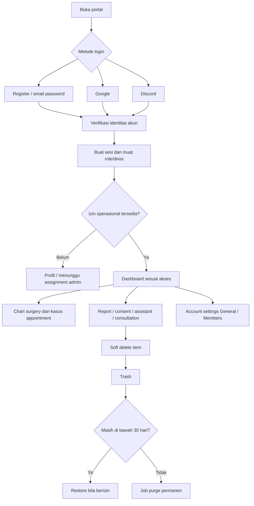

# Executive RP — Sprint 1 (revisi kebutuhan)
Tanggal: 8 Oktober 2026 • Status: spesifikasi untuk implementasi, belum diimplementasikan.
Dokumen ini menjadi acuan scope Sprint 1 terbaru dan mengungguli bagian SPEC.md yang bertentangan. Stack tetap Next.js, TypeScript, shadcn/ui, Tailwind CSS dan Vercel.

## 1. Scope dan perubahan
| Area | Scope terbaru |
|---|---|
| Navbar | Logo → Search → Notifikasi → User account |
| Account menu | Account settings dan Logout |
| Account settings | Tab General dan Members |
| Login | Register email/password, Google, Discord |
| Homepage | Sapaan, announcement terbaru, line chart surgery, kartu minor/major, tabel kasus dari appointment |
| Sidebar | Dashboard; Report: Medical Service / Fire Department; Patient Consent; Case Assistant; Consultation; Announcement; Trash |
| Trash | Soft delete; restore sebelum batas; penghapusan permanen otomatis setelah 30 hari |
| Admin | Panel minimal untuk menetapkan divisi dan role; akses administrator |

Integrasi login FiveM dan pembatasan player online tidak lagi menjadi syarat Sprint 1. Duty, notifikasi realtime duty, plastic surgery, bar/donut chart dan fitur lama yang tidak tercantum ditunda; tidak dianggap dihapus dari roadmap. Appointment notifications dari kebutuhan sebelumnya tetap relevan dalam consultation; transport realtime perlu keputusan implementasi, tidak mengasumsikan terpasang otomatis.

## 2. Autentikasi dan identitas
Register email/password + login akun terdaftar, Google OAuth dan Discord OAuth. Profil terhubung ke user_id web, bukan hanya identitas karakter FiveM. Satu user dapat memiliki beberapa provider; simpan provider + provider_account_id yang unik. Jangan menggabungkan akun otomatis hanya karena email provider sama; linking membutuhkan sesi terautentikasi/verifikasi.

Email/password membutuhkan verifikasi email, reset password dan login failure feedback sebagai kebutuhan pendukung. User Google/Discord tanpa credential password tidak mendapatkan form ganti password lokal. Logout mencabut sesi aplikasi, bukan memutus semua sesi Google/Discord. Default user baru belum memiliki divisi dan menggunakan izin minimal; admin menetapkan divisi/role sebelum akses operasional. Members menampilkan seluruh akun terdaftar, termasuk yang belum diberi divisi.

## 3. Navbar dan account settings
Search global dibuka dengan ⌘K (Mac) / Ctrl+K (Windows), dengan input, hasil berkelompok dan navigasi keyboard. Search mengikuti izin data, termasuk division dan psychiatry. Notifikasi memakai layout referensi dengan All / Mentioned / Janji Temu dan deep link sesuai dokumen sebelumnya.

| General | Perilaku |
|---|---|
| Nama | Editable display name; tidak mengubah identitas provider secara otomatis |
| Password | Hanya akun yang memiliki email/password credential; minta password sekarang dan konfirmasi password baru |
| Foto profil | Upload/ganti; avatar inisial fallback; validasi ukuran dan tipe gambar |
| Notifikasi toggle | Menyimpan preferensi in-app; default interpretasi: toast/bunyi dimatikan, feed dan unread tetap tersedia. Semantik toggle masih perlu konfirmasi sebelum implementasi |
| Role | Read-only; label role dari admin |
| Divisi | Read-only badge; berasal dari admin panel; keadaan belum ditetapkan ditampilkan eksplisit |

Members: nama, avatar, badge divisi, role, metode akun (Register/Google/Discord; multi-provider boleh lebih dari satu), dan pencarian/sort. Tidak menampilkan password, provider token atau informasi kontak privat. Tab ini merupakan direktori akun terdaftar, bukan otomatis daftar employee game atau fitur invite. Cakupan visibilitas default internal user login; aksi edit role/divisi hanya di admin panel, bukan tab Members.

## 4. Homepage
| Elemen | Perilaku |
|---|---|
| Header | Sapaan berdasarkan display name dan waktu WIB; announcement terbaru yang dipublikasikan dan boleh dibaca |
| Line chart | Total surgery; All time, Day, Week, Month, Year, Range |
| Cards | Total Minor Surgery dan Total Major Surgery; mengikuti periode chart |
| Tabel | Kasus baru dari consultation/appointment; default created_at descending; filter tanggal dan sort |

Line chart menghitung procedure.id unik berstatus completed dengan laporan operasi final yang berlaku, berdasarkan performed_at, bukan appointment atau tanggal submit report. Kasus dari appointment belum otomatis dihitung sebagai surgery. Usulan denominator Sprint 1: minor + major; plastic ditunda dan tidak dimasukkan tanpa keputusan kategori. Revisi laporan tidak menggandakan kasus.

Periode default chart: Week sebagai usulan. Day memilih tanggal tertentu dan bucket per jam; Week Senin–Minggu bucket harian; Month bucket harian; Year bucket bulanan; Range memiliki start/end tanggal inklusif dari UI (server menggunakan awal hari berikutnya sebagai batas akhir eksklusif). All time memilih bucket bulan/tahun sesuai panjang data. Rentang kosong menampilkan titik nol/empty message, bukan error. Date grouping dalam Asia/Jakarta; simpan timestamp UTC.

Tabel appointment: pasien/label kasus, keluhan ringkas, dokter tujuan atau belum ditugaskan, jadwal, waktu dibuat, status. Klik membuka consultation detail. Filter tanggal tabel memakai tanggal jadwal appointment dan independen dari periode surgery chart; default sort terbaru memakai waktu dibuat. Sort: terbaru/terlama, jadwal terdekat/terjauh, nama pasien A–Z/Z–A; tie-break id untuk pagination stabil. Appointment cancelled tetap muncul dengan status bila tidak di-trash; default filter status belum ditetapkan.

Announcement terbaru mengikuti published_at, bukan draft/updated_at. Teks boleh ditampilkan ringkas dengan link detail; jika kosong tampilkan belum ada announcement.

## 5. Navigasi dan halaman
| Menu | Route usulan | Scope |
|---|---|---|
| Dashboard | /dashboard | Homepage |
| Report → Medical Service | /reports/medical | Laporan medis dan subtype sesuai izin |
| Report → Fire Department | /reports/fire | Laporan FD |
| Patient Consent | /patient-consents | Form SAHD, arsip dan ekspor sesuai PATIENT-CONSENT.md |
| Case Assistant | /case-assistant | Panduan RP berdasarkan SOP; tanpa SOP tampil belum tersedia |
| Consultation | /consultations | Janji temu, assignment dokter, hadir/batal/selesai dan detail kasus |
| Announcement | /announcements | Daftar dan detail; create/publish dibatasi role |
| Trash | /trash | Item soft-deleted sesuai permission, restore dan countdown |
| Account settings | /settings/account | General / Members |
| Admin panel | /admin | Assignment role/division dan pengelolaan user minimal; menu tambahan hanya untuk admin |

Scope submenu Report mengikuti izin, bukan memberikan seluruh user akses kedua divisi. User tanpa divisi tetap bisa pengaturan akun, Members jika diizinkan, dan announcement yang sesuai; data operasional terproteksi.

## 6. Trash 30 hari
Tombol delete menandai deleted_at/deleted_by. Item tidak tampil di daftar biasa, search, analytics, atau ekspor normal. Trash memperlihatkan jenis, judul, waktu dihapus, sisa waktu dan restore. Purge pada deleted_at + interval 30 hari (durasi, bukan akhir bulan), dengan job persisten/scheduler yang provider-nya ditentukan. Menunggu job tidak boleh menjamin restore lewat batas: endpoint restore memeriksa expires_at di transaksi.

Restore mengembalikan item dan status sebelumnya jika dependency masih valid. Jika report/consent/appointment saling terkait, jangan cascade-delete data aktif tanpa aturan; tampilkan dependency conflict. Purge membersihkan dokumen/attachment terkait yang tidak dipakai sumber lain, mencabut share link dan membersihkan index. Backup mengikuti retensi provider yang harus didokumentasikan; jangan menjanjikan penghapusan semua backup tepat 30 hari. Audit minim data tetap dapat disimpan sesuai kebijakan.

Objek trash Sprint 1: report, patient consent, consultation/appointment dan announcement sebagai usulan. Akun pengguna, duty dan SOP tidak masuk purge otomatis ini. Jenis yang dapat di-trash dan siapa yang bisa restore perlu disepakati sebelum implementasi. Tidak menambahkan tombol purge manual sebagai fitur wajib pengguna.

## 7. Penyesuaian model data
| Tabel | Kolom/aturan penting |
|---|---|
| users | id, display_name, avatar_asset_id, email opsional, email_verified_at, status, created_at |
| auth_accounts | user_id, provider, provider_account_id; UNIQUE(provider, provider_account_id) |
| password_credentials | user_id unique, password_hash, password_changed_at; tidak menyimpan plaintext |
| sessions | user_id, token_hash, expires_at, revoked_at |
| verification_tokens | token_hash, purpose, expires_at, consumed_at |
| user_preferences | user_id unique, notifications_enabled, timezone |
| user_roles | user_id, role_id, division scope |
| user_divisions | user_id, division_id, assigned_by, assigned_at; mendukung assignment admin |
| announcements | id, title, body, status, published_at, author_user_id, audience_scope, deleted_at, deleted_by |
| reports / consents / appointments | author_user_id; deleted_at, deleted_by; FK user menggantikan dependensi employee login pada scope web |
| notifications | recipient_user_id, is_mentioned, target_type/id, read_at; appointment yang ditag satu item per penerima |
| assets | owner_user_id, private storage_key, purpose, checksum; image profile vs dokumen |

Employee/character dari rancangan lama tetap opsional untuk integrasi selanjutnya. Jangan membuat employee palsu saat register; linking user–employee dilakukan saat integrasi tersedia. Semua ID baru UUID dan waktu UTC.

## 8. Activity diagram Sprint 1

## 9. Kriteria penerimaan Sprint 1
- Register/Google/Discord memiliki sesi terverifikasi; user baru tidak memperoleh divisi/role dari browser.
- Account name/photo dapat diubah; role/divisi read-only; password hanya akun credential.
- Members memuat ketiga metode registrasi, tanpa data rahasia.
- Navbar urut sesuai instruksi; search shortcut Mac/Windows, notifikasi deep link dan logout.
- Announcement latest hanya mengambil published item berizin yang tidak di-trash.
- Line chart enam filter, batas WIB, zero buckets, kasus surgery unik; kartu mengikuti periode.
- Tabel appointment sort default terbaru, filter tanggal jadwal, pagination stabil dan link detail.
- Menu report dipisah dan diotorisasi; Case Assistant tidak mengarang SOP klinis.
- Trash dapat restore sebelum 30 hari; restore lewat batas ditolak; purge idempotent dan dependency-aware.
- State loading/empty/error/permission, mobile drawer, keyboard dan label aksesibilitas diuji.

## 10. Keputusan yang masih terbuka
Provider autentikasi/database/storage; cakupan toggle notifikasi; batas visibility Members; satu/multi-divisi secara UI; objek trash dan izin restore; default range chart; skema nomor consent; SOP dan template report. Form consent yang diberikan tetap sumber format yang disetujui.
Figma dan preview lokal yang lama belum diperbarui untuk scope ini; dokumen ini tidak menyatakan implementasi selesai.
