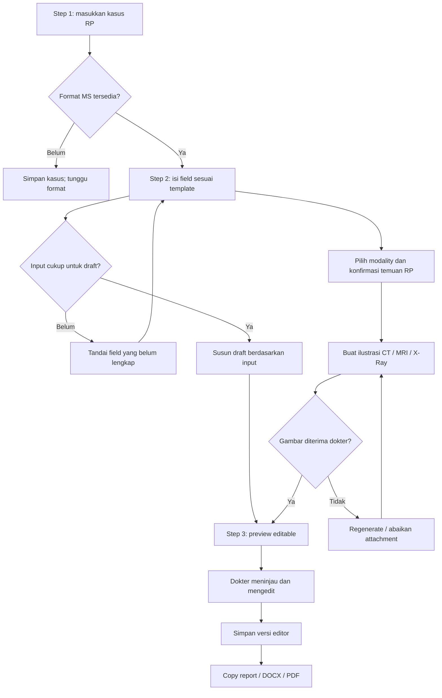

# Executive RP — Sprint 2: Medical Service Reports
Tanggal: 8 Oktober 2026 • Status: spesifikasi; belum diimplementasikan.
Mengikuti fondasi akun, hak akses, navbar dan navigasi Sprint 1. Format operasi Medical Service (MS) sudah diberikan; lihat [MEDICAL-REPORT.md](MEDICAL-REPORT.md). Screenshot consent adalah template consent, bukan template report MS. Report FD menunggu format dan tidak termasuk authoring Sprint 2.

## 1. Scope yang diminta
| Area | Perilaku |
|---|---|
| Report MS | User mengisi kasus dan beberapa informasi penting; aplikasi menyusun draft mengikuti format yang diberikan pengguna |
| Form | Field mengikuti format report MS; tidak menambah struktur wajib berdasarkan asumsi |
| Preview | Isi report dapat diedit, dipilih dengan mouse/keyboard dan disalin |
| Export | DOCX yang kompatibel Google Docs dan PDF; Google Docs native jika jalur tersebut dipilih dan koneksi tersedia |
| Gambar | Ilustrasi CT Scan, MRI, X-Ray berdasarkan kasus RP; bukan hasil pemeriksaan klinis aktual |
| Report FD | Menyusul; tidak menghasilkan template FD buatan sendiri |

## 2. Wizard tiga langkah
### Step 1 — Case
User menuliskan kasus yang ditangani, misalnya “GSW di dada sedikit atas”. Kasus merupakan input naratif, bukan bukti lengkap temuan. Draft kasus tersimpan agar bisa dilanjutkan. Pemilihan modality CT Scan/MRI/X-Ray tersedia dalam alur bila diperlukan; pengisian tambahan hanya sesuai format/SOP atau untuk memperjelas input.

Jika data yang diperlukan format belum ada, tandai bagian belum diisi atau minta kelengkapan; jangan mengarang identitas, sisi/lokasi pasti cedera, hasil pencitraan, dosis, tindakan yang telah dilakukan, atau outcome pasien. Contoh GSW tidak otomatis membuktikan tidak ada perforasi internal. Rekomendasi RP tetap perlu peninjauan dokter.

### Step 2 — Form sesuai format
Muat template_version yang dipilih dan tampilkan field yang benar-benar dibutuhkan. User cukup memasukkan informasi utama; data akun/pasien yang tersedia dapat diprefill secara jelas dan tetap sesuai hak akses. Kasus Step 1 tetap terlihat sebagai ringkasan dan dapat dikoreksi.

Generator menyusun draft dengan urutan heading, tabel, label, bahasa dan bagian tetap dari format pengguna. Gunakan field terstruktur untuk identitas dan metadata; generator hanya merapikan narasi berdasarkan input/SOP RP. Jika template/SOP belum tersedia, tampilkan belum tersedia, bukan report generik seolah-olah sesuai format.

Jika user kembali mengubah Step 1/2 setelah mengedit preview, tandai preview perlu diperbarui. Regenerate memberikan pilihan pertahankan edit/manual merge atau ganti draft dengan konfirmasi; tidak menimpa perubahan manual diam-diam.

### Step 3 — Editable preview
Preview merupakan editor dokumen native berisi teks/tabel, bukan gambar/canvas. User dapat mengedit narasi, melakukan drag selection, memilih teks dengan keyboard dan menyalin via button atau clipboard shortcut.

| Interaksi | Mac | Windows |
|---|---|---|
| Pilih seluruh isi editor | ⌘A saat editor fokus | Ctrl+A saat editor fokus |
| Salin teks terpilih | ⌘C | Ctrl+C |
| Tombol Copy report | Menyalin seluruh isi editor, tanpa navbar/form/control | Sama |

Copy button menyalin rich HTML + plain text fallback jika didukung; tampilkan sukses hanya setelah clipboard berhasil. Jika clipboard gagal, beri instruksi selection manual. Hanya teks terpilih disalin melalui shortcut standar. Attachment/gambar memiliki opsi salin/download terpisah bila clipboard editor tidak mendukung; jangan menjanjikan gambar ikut dalam plain text.

Save draft, Copy report, Export Docs/DOCX dan Export PDF menjadi aksi editor. Preview/manual edits adalah sumber ekspor; output generator lama tidak boleh menggantikan edit terakhir. Simpan berhasil sebelum snapshot export atau buat snapshot transaksi yang konsisten. Unsaved indicator dan konflik versi harus terlihat. Finalisasi/review mengikuti izin MS dan template final; user selalu bisa menyimpan draft.

## 3. Pencitraan RP berdasarkan kasus
CT Scan, MRI dan X-Ray dapat dibuat sebagai visual fiktif berbasis deskripsi kasus dan temuan RP yang dimasukkan/dikonfirmasi. CTA/MRA dari roadmap lama tidak dimasukkan Sprint 2 tanpa permintaan tambahan.

- Pisahkan rekomendasi modality, ilustrasi gambar dan narasi temuan report.
- Label visual “SIMULASI GTA RP — bukan hasil pemeriksaan medis” terlihat pada gambar/attachment dan caption ekspor.
- Kasus ambigu membutuhkan klarifikasi lokasi/sisi/temuan sebelum membuat visual spesifik. Jangan mengisi hasil negatif/positif yang belum dikonfirmasi hanya agar report lengkap.
- Simpan input_snapshot, modality, generated_at, generator/version, reviewed_by dan status ilustrasi. Dokter meninjau sebelum memasukkan visual ke report.
- Opsi regenerate tidak mengubah temuan yang sudah dikonfirmasi; versi gambar lama tidak dipakai tanpa pilihan user.
- Kegagalan pembuatan gambar tidak menghalangi menyimpan draft report. Tampilkan pending/failed/retry dan belum ada attachment.
- Gambar bukan sumber diagnosis otomatis. Tidak menyediakan dosis klinis nyata; materi mengikuti SOP fiktif server.
- Sertakan gambar dalam ekspor hanya bila format report mengizinkan; selain itu simpan sebagai lampiran terkait. Layout operasi mengikuti MEDICAL-REPORT.md; attachment tidak otomatis mengubah format.

## 4. Export dan arsip
DOCX: teks/tabel editable dan kompatibel Word/Google Docs; ekspor dari versi editor yang dipilih. Google Docs native merupakan opsi terpisah dengan akun Google terhubung; ekspor tidak otomatis mempublikasikan dokumen. PDF: snapshot read-only dengan layout yang sama, versi template, narasi dan gambar yang diterima. Periksa pagination, overflow, karakter khusus, dan proporsi gambar. Format tidak boleh disederhanakan tanpa instruksi pengguna.

Report disimpan pada arsip Medical Service, menggunakan author user_id dari Sprint 1, scope divisi dan nomor/version. Draft tidak masuk surgery analytics. Final operation report terkait procedure.id completed dihitung sekali sesuai aturan analytics; laporan consultation/psychiatry tidak otomatis menjadi surgery. Trash dan restore mengikuti Sprint 6.

## 5. Model data tambahan
| Entitas | Kolom/aturan |
|---|---|
| report_cases | id, report_id, case_text, input_snapshot, created_by, updated_at |
| template_versions | document_type MS, schema_json, fixed_sections, version, published_at; template sesuai format pengguna |
| report_versions | editor_document_json, plain_text_snapshot, generation_input_snapshot, template_version_id, version, save_status/finalized_at |
| report_generation_jobs | id, report_id, input_version, status, model/provider_version, error_code, completed_at; output draft, tidak auto-final |
| report_imaging_assets | id, report_version_id nullable saat draft, case_input_snapshot, modality CT/MRI/X_RAY, asset_id, status, reviewed_by, reviewed_at, generation_version, caption_rp |
| document_exports | report_version_id, format docx/pdf/google_doc, asset_id/provider_file_id, status; versi immutable |

Editor model kanonis mempertahankan struktur template; HTML output harus disanitasi dan tidak mengeksekusi script. Simpan attachment ID privat, bukan URL sementara kedaluwarsa. Linking image ke versi final dipatok; draft regenerasi memakai concurrency/version check.

## 6. API usulan
POST /api/reports/medical/drafts (kasus); PATCH /api/reports/:id/form; POST /api/reports/:id/generate; PATCH /api/reports/:id/editor; POST /api/reports/:id/imaging; PATCH /api/reports/:id/imaging/:assetId/review; POST /api/reports/:id/exports. Job hasil dapat dipoll/realtime sesuai provider yang dipilih.
Semua operasi memeriksa sesi, izin divisi/jenis laporan, versi input dan idempotency; tidak menerima role/division dari browser sebagai otorisasi. Error schema field, job, clipboard dan export ditampilkan berbeda sesuai aksi.

## 7. Activity diagram

## 8. Kriteria penerimaan
1. Case Step 1 diteruskan ke form tanpa hilang; format consent tidak dipakai sebagai report.
2. Field, urutan dan isi tetap mengikuti format MS yang diberikan; data tak tersedia tidak dikarang.
3. Output otomatis editable dan tidak auto-final; edit manual tidak hilang saat regenerate/back.
4. Drag selection dan ⌘A/Ctrl+A serta ⌘C/Ctrl+C bekerja saat editor fokus.
5. Copy report hanya menyalin isi dokumen; success/error clipboard benar.
6. DOCX/PDF memakai edit terbaru, versi konsisten, tabel tidak rusak, gambar berlabel simulasi.
7. CT/MRI/X-Ray tercatat sebagai ilustrasi RP, modality/input sesuai, perlu review untuk attachment.
8. Kegagalan generator/visual/export dapat dicoba ulang dan tidak menghilangkan draft.
9. Otorisasi MS, subtype sensitif, export/download dan trash terlindungi.
10. Report FD tetap menunggu format.

## 9. Dependency
Format operasi MS sudah tersedia; format consultation/psychiatry dan kebijakan field wajib finalisasi masih menunggu. Belum dipilih generator, editor, font ekspor atau layanan pembuatan gambar. Tidak ada implementasi wizard/export/generator produksi pada revisi dokumen ini.
