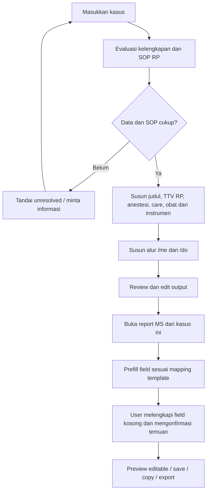

> Mapping terbaru: [MEDICAL-REPORT.md](MEDICAL-REPORT.md) menggantikan pemetaan konseptual di bawah, terutama judul kasus dan discharge medicine yang tidak memiliki field tersendiri pada template.

# Executive RP — Sprint 3: Case Assistant terintegrasi report MS
Tanggal: 8 Oktober 2026 • Status: spesifikasi; belum diimplementasikan.
“Care assistant” pada revisi pengguna dianggap nama alternatif Case Assistant, bukan modul terpisah. Scope bergantung pada template report MS Sprint 2 dan SOP RP server yang disetujui.

## 1. Input dan hasil
User cukup memasukkan deskripsi kasus sebagai input awal. Informasi tambahan hanya diminta bila kasus ambigu atau SOP membutuhkan data yang belum tersedia; identitas dan pemeriksaan aktual tidak dibuat sendiri.

| Bagian output | Isi | Status sumber |
|---|---|---|
| Judul kasus | Ringkasan kasus yang ditangani | Diturunkan dari input user |
| TTV Before | Tekanan darah, denyut nadi, laju napas, suhu, SpO2; unit jelas | Input pemeriksaan RP atau nilai skenario yang diberi label simulasi |
| TTV After | Parameter sama setelah tindakan | Temuan RP yang dikonfirmasi; simulasi expected outcome tidak dianggap hasil aktual |
| Anestesi pre-operation | Jenis lokal/umum, rekomendasi obat/dosis RP dan alasan berbasis SOP | Usulan untuk review dokter |
| Instrumen surgery | Daftar instrumen per tahap/kasus dan fungsi RP | Katalog SOP RP |
| Follow-up care | Observasi, perawatan dan jadwal kontrol karakter | Usulan SOP RP |
| Discharge medicine | Nama obat, dosis RP, frekuensi, durasi dan catatan | Katalog fiktif yang disetujui server |
| Alur /me dan /do | Kedatangan hingga pemeriksaan, consent, persiapan, anestesi, operasi, observasi dan pulang | Script RP editable; memberi ruang respons pasien |

Tidak membuat rentang/dosis umum dunia nyata sebagai default. Permintaan obat rekomendasi dan dosis umum dipenuhi sebagai nilai standar dalam katalog/SOP Executive RP; jika SOP belum tersedia, output menyatakan belum tersedia. Jangan menambahkan angka klinis dari tebakan generator.

## 2. Alur penggunaan
1. User memasukkan kasus yang ditangani.
2. Assistant mengidentifikasi judul dan bagian yang dapat dibuat dari input/SOP, menandai informasi yang belum diketahui.
3. Tampilkan hasil terstruktur dan label: Input user / Simulasi RP / Rekomendasi SOP / Dikonfirmasi dokter.
4. User dapat mengedit hasil, mengonfirmasi temuan pemeriksaan RP serta menerima/menolak rekomendasi.
5. Saat membuka report MS dari kasus tersebut, aplikasi mengisi draft field yang sudah memiliki mapping template secara otomatis. User tidak perlu menyalin ulang dan cukup melengkapi yang kurang.
6. Field hasil simulasi/rekomendasi tetap berlabel belum dikonfirmasi; report tidak otomatis final hanya karena field terisi.
7. Edit, preview, copy, save, review dan export mengikuti Sprint 2.

## 3. Alur roleplay /me dan /do
Tahap default: pasien datang → pemeriksaan awal/TTV → anamnesis dan pemeriksaan kasus → pemeriksaan penunjang bila relevan → persetujuan → persiapan/instrumen → anestesi RP → tindakan operasi → observasi/TTV After → edukasi, obat pulang dan kontrol.

Urutan mengikuti SOP dan kasus, bukan memaksakan operasi pada semua kasus. Jika kasus tidak memerlukan operasi, alur berhenti pada penanganan/konsultasi yang sesuai. /me menggambarkan tindakan karakter; /do mendeskripsikan observasi atau meminta respons, tidak menetapkan pasien berhasil pulih/hasil negatif tanpa konfirmasi. Setiap tahap memiliki tombol Copy /me, Copy /do dan Copy alur; seluruh output dapat diedit.

## 4. Prefill report MS
| Output assistant | Field report konseptual | Syarat |
|---|---|---|
| case_title | Judul kasus | Mapping final mengikuti template MS |
| vitals_before | TTV Before | Simpan nilai, unit, observed_at/source dan status konfirmasi |
| vitals_after | TTV After | Temuan setelah tindakan atau simulasi eksplisit |
| anesthesia_plan | Anestesi | Jenis, label obat/dosis RP dan versi SOP |
| followup_care | Follow-up care | Instruksi, jadwal dan review status |
| discharge_medications | Discharge medicine | Item katalog dan dosis RP; tidak otomatis jadi resep terkonfirmasi |

Mapping memakai field key stabil + template_version_id, bukan mencocokkan label secara acak. Jika template tidak punya field, jangan menambahkan bagian baru tanpa persetujuan; simpan hasil assistant terpisah dan tampilkan belum terpetakan. Instrumen dan script /me-/do tetap tersedia di assistant; masuk report hanya bila format memintanya.

Field kosong diprefill; field yang sudah diedit user tidak ditimpa. Setelah kasus/SOP berubah, tampilkan perubahan dan beri pilihan pembaruan per field atau pertahankan versi sebelumnya. Simpan draft report dari snapshot hasil assistant yang diterapkan. Existing report dapat ditautkan eksplisit; jangan menulis diam-diam ke report lain dengan nama pasien serupa.

## 5. Guardrail RP dan kelengkapan
TTV Before/After simulasi tidak menggambarkan pengukuran sebenarnya. Assistant membedakan rencana dengan tindakan yang sudah dilaksanakan, obat yang direkomendasikan dengan yang benar-benar diberikan, dan perkiraan pemulihan dengan hasil pasien. Waktu Before/After tidak diisi seolah pemeriksaan sudah terjadi. Tanda kondisi gawat pada skenario menjadi kebutuhan eskalasi/alur RP sesuai SOP, bukan instruksi medis nyata.

Obat/anestesi/dosis memakai katalog terkurasi beserta konteks, batas penggunaan RP, approved_by, version dan unit. Assistant tidak menggabungkan dosis berbeda atau mengubah unit otomatis tanpa aturan katalog. SOP kosong/tidak cocok/konflik menghasilkan unresolved item dan user tetap dapat menyimpan kasus/draft, bukan rekomendasi rekaan.

## 6. Data dan integrasi
| Entitas | Penyesuaian |
|---|---|
| case_assistant_sessions | id, author_user_id, division_id, case_text, encounter_id nullable, report_id nullable, status, created_at |
| case_assistant_versions | session_id, version, input_snapshot, sop_version_ids, structured_output_json, generator_version, reviewed_by, reviewed_at |
| case_vitals | assistant_version_id, stage before/after, parameter, value nullable, unit, source user/simulated, observed_at nullable, confirmed_by/at nullable |
| rp_medication_catalog | id, code, name_rp, category anesthesia/discharge, guidance_json, approved_by, version, active |
| report_assistant_mappings | template_version_id, assistant_output_key, report_field_key, mapping_version; UNIQUE(template_version_id, assistant_output_key) |
| report_prefill_applications | report_version_id, assistant_version_id, applied_fields_json, applied_by, applied_at; menyimpan provenance dan konflik |

Semua konten assistant berizin MS; tidak dapat diakses FD tanpa izin eksplisit. Background job memiliki status queued/generating/ready/needs_information/failed; stale output tidak diterapkan ke draft versi baru. Episode kasus memiliki ID stabil, bukan identitas dari teks bebas.

Endpoint usulan: POST /api/case-assistant/sessions; PATCH /api/case-assistant/:id/input; POST /api/case-assistant/:id/generate; PATCH /api/case-assistant/:id/output; POST /api/case-assistant/:id/review; POST /api/case-assistant/:id/report-draft; POST /api/reports/:id/assistant-prefill. Semua memeriksa versi, akses dan idempotency.

## 7. Activity diagram

## 8. UI
Input kasus di atas; tab Ringkasan, TTV Before/After, Anestesi, Instrumen, Follow-up & Discharge, Roleplay. Panel status menampilkan kelengkapan dan sumber/versi SOP; output belum dikonfirmasi memiliki badge. Tombol Buat/Buka report MS menuju wizard Sprint 2 dengan draft terisi; daftar field kurang ditampilkan. Tampilan structured cards, bukan satu paragraf panjang.

## 9. Kriteria penerimaan
- Input kasus menghasilkan seluruh bagian yang relevan atau alasan belum tersedia, tanpa mengarang SOP/dosis.
- Before/After berunit dan provenance jelas; expected After tidak berubah otomatis menjadi actual.
- Dosis/obat anestesi dan pulang merujuk katalog RP yang disetujui.
- Script meliputi alur kedatangan hingga selesai tindakan/pulang yang relevan, editable dan dapat disalin.
- Buka report MS membuat satu draft terkait; field terpetakan terisi, field kurang tetap terlihat.
- Regenerate tidak menimpa manual edits; konflik diselesaikan per field.
- Template berbeda/field tidak tersedia tidak menghasilkan bagian tambahan tanpa instruksi.
- Konfirmasi/finalisasi terpisah dari generate/prefill; export memakai versi editor terbaru.
- Akses, error/retry, stale job dan pengulangan tombol tidak menggandakan report.

## 10. Dependency dan status
Template operasi MS tersedia pada MEDICAL-REPORT.md; mapping definitif mengikuti tabel pada dokumen tersebut. Menunggu SOP anestesi/obat/dosis fiktif, definisi skenario TTV dan katalog instrumen. Sprint 3 merupakan spesifikasi dan belum menjadi fitur produksi/preview live. Tidak memperluas fitur ke rekomendasi medis dunia nyata.
