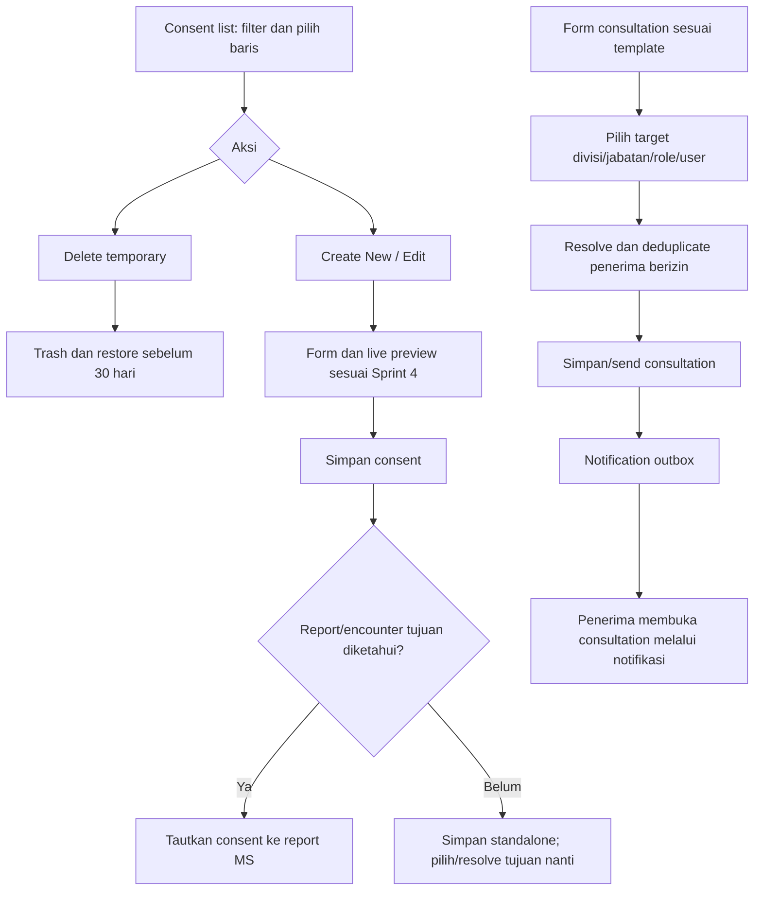

> Format Consultation sudah diberikan: [CONSULTATION.md](CONSULTATION.md) menjadi referensi field, author dan mention terbaru, menggantikan pernyataan format belum tersedia di bawah.

# Executive RP — Sprint 5: Consent list, report links dan consultation mentions
Tanggal: 8 Oktober 2026 • Status: spesifikasi, belum implementasi.
Melanjutkan Sprint 1–4. Format consent telah diberikan; format consultation belum diberikan. Consultation tetap modul appointment/kasus dari Sprint 1, sekarang mengikuti format pengguna dan mendukung mention lintas divisi sesuai izin.

## 1. Patient consent: daftar utama
Halaman utama /patient-consents menampilkan tabel consent tersimpan, bukan langsung form. Tombol Create New membuka form/live preview Sprint 4. Setelah save berhasil, kembali/tautan ke daftar dan tampilkan item baru tanpa duplikasi.

| Elemen | Perilaku |
|---|---|
| Filter waktu | All time, Day, Week, Month, Year, Range Date |
| Default | All time; urutan terbaru (usulan) |
| Kolom | Checkbox, nomor consent, pasien, medic, tanggal dibuat, status, report terkait, actions |
| Checkbox baris | Select item; checkbox header memilih halaman yang terlihat; select-all lintas pagination harus eksplisit bila nanti tersedia |
| Actions per row | Edit; Delete temporary |
| Delete temporary | Soft delete ke Trash; restore/purge 30 hari mengikuti Sprint 1 |
| Create New | Form wajib/signature/live preview dari Sprint 4 |

Filter menggunakan created_at consent sebagai tanggal arsip, bukan DOB atau tanggal update. Day memilih tanggal, Week Senin–Minggu, Month/Year memilih periode, Range memiliki tanggal awal/akhir inklusif UI dengan query [awal hari, awal hari setelah akhir). WIB pada UI; timestamp UTC dalam DB. Perubahan filter mereset pagination dan selection agar tidak menjalankan aksi pada item tersembunyi.

Checkbox menyediakan dasar seleksi; bulk action bukan otomatis requirement. Usulan minimal toolbar jumlah terpilih; bulk temporary delete dapat ditambahkan setelah scope aksi massal disetujui. Row action tidak boleh ikut toggle checkbox. Loading/empty/error/forbidden, clear filter dan restore dari Trash harus jelas.

Edit draft memperbarui versi dengan concurrency check; edit versi confirmed menghasilkan revisi sesuai aturan sebelumnya. Delete temporary tidak cascade-delete report yang aktif.

## 2. Consent otomatis menjadi link pada report MS
Consent yang dibuat dari report/encounter terhubung langsung ke report MS sebagai tautan setelah save berhasil. User tidak perlu copy-paste URL. Report menyimpan FK/relation dan versi consent, bukan sekadar URL string bebas; UI/editor/export merender link dari relasi tersebut.

Konteks penautan:
- Dari report MS: Create Patient Consent membawa report_id/encounter_id dan kembali ke report yang sama; save + linkage atomik/idempotent.
- Dari halaman daftar/Create New mandiri: belum tentu memiliki report tujuan; sediakan pemilihan report MS yang berizin atau tautkan saat report dibuat dari encounter yang sama. Jangan menautkan ke seluruh report berdasarkan nama pasien saja.
- Jika consent dibuat sebelum report, simpan encounter/link context lalu resolve saat report dari konteks itu dibuat. Jika tidak ada konteks, tandai belum terhubung; jangan mengklaim auto-linked tanpa target.

Bagian report “Patient Consent” memuat nomor, nama pasien, status dan tombol/link Buka consent. Posisi di report mengikuti template MS; jika format belum menyediakan lokasi, mapping menunggu template, tidak menambah struktur final diam-diam. Usulan satu report dapat memiliki beberapa consent dengan scope tindakan berbeda; kebutuhan jumlah akhirnya mengikuti template/SOP.

Draft report dapat mengikuti current consent version setelah user diberi tahu; final report mematok consent_version_id untuk mencegah dokumen historis berubah. DOCX/PDF mempertahankan hyperlink ke versi tersebut. Link default internal berotorisasi; tidak otomatis membentuk link publik. Link khusus shareable mengikuti Sprint 4 bila dipilih.

Jika consent di-trash/void/purge: report tetap ada, relasi memberi status unavailable/withdrawn dan aksi perbaikan; tidak menampilkan file terhapus melalui cached public URL. Restore memulihkan akses bila versi masih ada. Sebelum finalisasi cek consent terkait masih valid sesuai SOP.

## 3. Consultation: format dan form
Halaman consultation menampilkan format yang diberikan pengguna; user hanya mengisi field yang ada. Metadata akun/tanggal/nomor dapat diisi sistem jika template meminta. Tidak memakai template consent atau membuat field wajib berdasarkan dugaan. Existing appointment data dari Sprint 1 dipetakan hanya ke field yang cocok dengan format consultation.

Format consultation masih menunggu pengguna; jenis dokumen, isi tetap, urutan tabel/heading, field wajib, slot mention, dan hubungan ke jadwal diturunkan setelah format diterima. Preview bersifat editable hanya bila format/alur memerlukannya; tidak otomatis menambah scope generator report ke consultation.

## 4. Mention recipients
Istilah diselaraskan dengan model Sprint 1: Medical Service/Fire Department merupakan divisi; jabatan/rank dapat menjadi filter di dalam divisi; Doctor umum/spesialis/farmasi merupakan role fungsional atau specialty. Nama label UI final dapat mengikuti istilah server tanpa mencampur permission admin dengan specialty klinis.

| Target mention | Pemilihan |
|---|---|
| Divisi / jabatan | Medical Service atau Fire Department; dapat dipersempit dengan jabatan yang dikonfigurasi admin |
| Role fungsional | Doctor umum, spesialis, farmasi; spesialis dapat disaring specialty jika data tersedia |
| User terdaftar | Nama user web aktif dari register/Google/Discord; bukan hanya employee FiveM |

Mention picker menampilkan chips target dan jumlah penerima setelah resolve. Dalam satu target: filter divisi + role/rank diinterseksikan; beberapa chips target digabung union. Resolusi sesuai active membership dan izin consultation; dokter tidak diberi akses dokumen hanya karena disebut. Jangan membocorkan nama pasien/snippet kepada target tanpa izin.

Recipients di-snapshot ketika consultation disimpan/dikirim. Deduplicate user yang cocok dengan beberapa target; satu event satu notification per user. Mention belum disimpan tidak mengirim notification. Trigger awal pada successful save/send consultation; edit hanya menotifikasi penerima baru atau perubahan appointment yang relevan, bukan setiap keystroke/autosave. Penambahan anggota divisi di kemudian hari tidak otomatis menerima event lama.

User termention menerima notification dengan target consultation_id dan anchor mention jika tersedia; klik membuka consultation terkait. Jika dokumen mengandung appointment, item muncul All, Mentioned dan Janji Temu untuk penerima yang ditag; consultation tanpa jadwal tidak otomatis dikategorikan Janji Temu. Non-mentioned recipients mengikuti kebutuhan broadcast appointment sebelumnya; tidak disebut sebagai mention. Unread count dan realtime transport mengikuti spesifikasi notifikasi; delivery queued/outbox idempotent dan reconnect catch-up.

Empty recipient set (tidak ada user cocok), nonaktif, izin dicabut atau target dihapus menghasilkan feedback yang jelas. Akses lintas MS/FD harus diotorisasi eksplisit; scope mention tidak memperluas permission dokumen secara tersembunyi.

## 5. Model data
| Entitas | Kolom/aturan |
|---|---|
| report_consents | id, report_id, consent_id, consent_version_id nullable pada draft, encounter_id optional, linked_by, linked_at, status; unique relation report/consent/version sesuai kebijakan |
| consents | created_at, deleted_at/deleted_by, nomor/status; indeks created_at untuk filter arsip |
| consultation_templates / template_versions | format dan schema pengguna; versi tetap |
| consultation_mentions | id, consultation_id, target_type division/rank/functional_role/user, target_id, filter_snapshot, created_by |
| consultation_mention_recipients | mention_event_id, recipient_user_id, matched_targets_snapshot; UNIQUE(event_id,recipient_user_id) |
| notifications | event_key, recipient_user_id, consultation_id/target_id, is_mentioned, category appointment/consultation, read_at |

Domain role fungsional disimpan terpisah dari permission_roles bila semantiknya berbeda. Status linkage/mention mempunyai audit; all writes memakai auth user_id, validasi input dan scope.

## 6. API usulan
GET /api/consents?period=&from=&to=&cursor=; POST /api/consents (report_id/encounter_id optional); PATCH /api/consents/:id; DELETE /api/consents/:id (soft delete); POST /api/reports/:id/consents; GET /api/consultations/templates; GET/POST /api/consultations; POST /api/consultations/mention-preview (resolve counts); POST /api/consultations/:id/mentions. Backend tidak mempercayai resolved recipients dari browser; resolve ulang saat event commit.

## 7. Activity diagram

## 8. Kriteria penerimaan
- Daftar consent menjadi landing page; create/edit/delete sesuai izin dan format.
- Enam filter waktu tepat WIB, default terbaru, selection tidak bocor lintas filter/page.
- Checkbox dan action row tidak saling memicu; temporary delete/restore/purge sesuai Sprint 1.
- Consent dari report otomatis linked tepat satu kali setelah save; standalone tidak linked ke report salah.
- Final report mematok versi; link pada web/DOCX/PDF mengikuti izin dan status sumber.
- Consultation memakai format pengguna, bukan template buatan sendiri.
- Mention divisi/jabatan/role/user dapat resolve dan deduplicate; save-trigger notification satu kali.
- Mention tidak membocorkan data lintas izin; klik menuju consultation/anchor yang benar.
- Appointment tagged muncul pada filter yang sesuai; recipients nonmentioned tetap bukan is_mentioned.

## 9. Status dan dependency
Menunggu format consultation, format MS untuk slot link consent, data jabatan/role fungsional dan kebijakan akses lintas divisi. Kebutuhan Sprint 5 terspesifikasi; daftar/prefill linkage/mention belum diimplementasikan di backend atau Figma.
